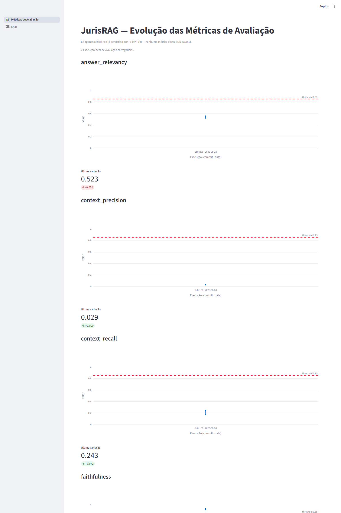

# portfolio-para-engenharia-de-ia-aplicada

Portfólio de projetos aplicados de Engenharia de IA — LLMs, RAG, agentes e, principalmente, avaliação de qualidade de sistemas de IA em produção. Cada projeto vive em sua própria pasta numerada, com stack e documentação independentes.

## Projetos

### 1. [JurisRAG](1_JurisRAG/) — RAG Jurídico com Avaliação Automatizada

Um RAG sobre jurisprudência do STJ construído do zero, cujo objetivo central não é só responder bem — é provar, com métricas, que o sistema não alucina.

- **Pipeline RAG do zero**: ingestão e normalização do dataset público do STJ, duas estratégias de chunking testadas e comparadas, embeddings indexados em PostgreSQL/pgvector, retrieval + geração orquestrados com LangGraph.
- **Golden dataset**: 35 casos reais de jurisprudência, validados manualmente (nunca gerados só por IA).
- **Avaliação automatizada**: suíte com DeepEval medindo toda resposta em 4 dimensões — faithfulness, context precision, context recall, answer relevancy — com threshold mínimo por métrica.
- **Gate de CI/CD**: GitHub Actions bloqueia merge quando qualquer métrica cai abaixo do threshold.
- **Dashboard**: Streamlit + Plotly mostrando a evolução histórica das métricas ao longo das execuções.
- **Chat**: interface para interagir com o pipeline RAG e ver as respostas (com citações) na prática.

Documentação completa, specs (Spec-Driven Development) e como rodar: [1_JurisRAG/](1_JurisRAG/).
